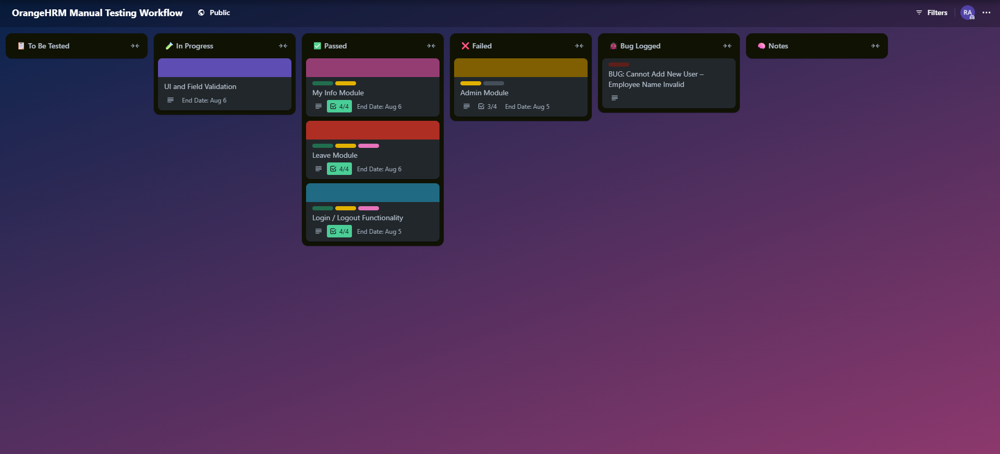

# 🧪 OrangeHRM Manual Testing Project

This repository contains all documents and tools used to manually test the [OrangeHRM Demo Site](https://opensource-demo.orangehrmlive.com/).

- [📄 Test Plan](./docs/test-plan.pdf)
- [📋 Test Cases](https://docs.google.com/spreadsheets/d/1QjCalZgciD0Q1mVcVMCk5PgP1hyuumjceZmTXa4qYUs/edit?usp=sharing)
- [🐞 Bug Report](https://docs.google.com/spreadsheets/d/18GXAUOUuT3KtkD56pjYPh8O9O40lOWkvK9TZTusZdp8/edit?usp=sharing)

This manual testing project was carried out using the **OrangeHRM Demo Site** as the application under test. Test cases and bug reports were documented using **Google Sheets**, task and workflow management were organized via **Trello**, and all project assets are maintained and versioned on **GitHub**.

### Trello Workflow [🔗 View Trello Board](https://trello.com/b/G8X9RpjH)

---

### 📌 Note
This is my first manual testing project, created to demonstrate my skills in writing test cases, executing tests, logging bugs, and managing test workflows using collaborative tools.

